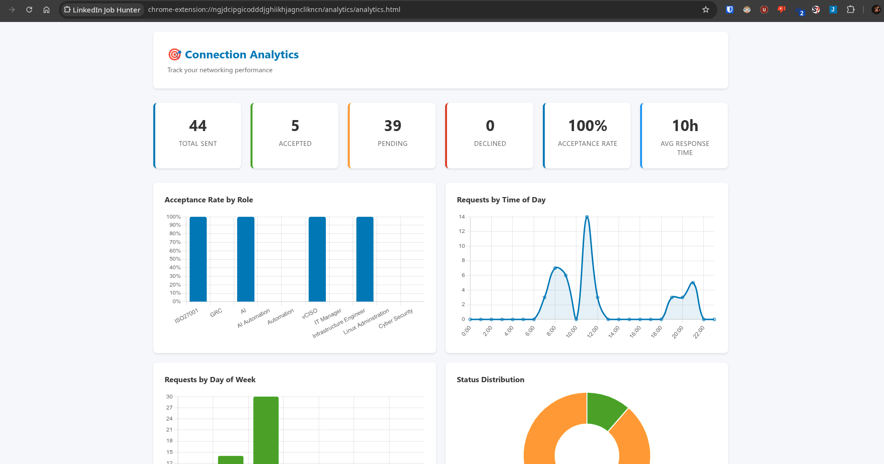

# LinkedIn Job Hunter 🎯

A Chrome browser extension that automatically discovers job opportunities through your LinkedIn network using human-like behavior patterns.

## ⚠️ Important Disclaimers

**Legal & Ethical Use:** This extension is for educational and personal productivity purposes. Users are responsible for complying with LinkedIn's Terms of Service. Use responsibly and respect rate limits.

**Detection Risk:** While designed to mimic human behavior, automated tools may still be detected. Use conservative settings and monitor your account.

## Features

### Opportunity Discovery
- **Smart Opportunity Detection**: Automatically identifies job postings, hiring announcements, and career opportunities in your LinkedIn feed
- **Network Crawling**: Scans your extended network for warm opportunities from connections
- **Keyword Matching**: Customizable keywords for targeted job discovery
- **Real-time Monitoring**: Live scanning of feed updates and profile changes

### Network Expansion
- **Automated Connection Requests**: Send personalized connection requests to professionals in your target roles
- **Smart Targeting**: Filter by roles, companies, and hiring indicators
- **Personalized Messages**: Customizable templates for connection requests
- **Daily Limits**: Conservative limits (25-30 invites/day) for safe operation
- **Connection Analytics**: Track acceptance rates, response times, and success metrics

### Job Application Automation
- **Auto-Apply**: Automatically apply to jobs matching your criteria
- **Distance Filtering**: Filter by remote, hybrid, or onsite with location-based distance calculation
- **Salary Filtering**: Set minimum/maximum salary requirements
- **Application Tracking**: Track all applications with status updates
- **Cover Letter Detection**: Identify jobs requiring additional materials

### Analytics & Insights
- **Connection Analytics Dashboard**: Visualize acceptance rates, response times, and networking performance
- **Role-based Analysis**: See which roles have highest acceptance rates
- **Time Analysis**: Optimize when to send requests based on time-of-day and day-of-week data
- **Application Tracking**: Monitor job application status and outcomes

### Safety & Privacy
- **Human-like Behavior**: Implements realistic delays, scrolling patterns, and interaction timing
- **Rate Limiting**: Conservative daily limits (80-150 profiles) to avoid detection
- **Local Storage**: All data stored locally for privacy
- **No External Servers**: All operations happen in your browser

## Installation

### Method 1: Chrome Web Store (Recommended)
*Coming soon - extension will be submitted to Chrome Web Store*

### Method 2: Manual Installation (Developer Mode)

1. **Download the Extension**
   ```bash
   git clone <repository-url>
   cd linkedin-job-hunter
   ```

2. **Enable Developer Mode**
   - Open Chrome and go to `chrome://extensions/`
   - Enable "Developer mode" (toggle in top-right corner)

3. **Load the Extension**
   - Click "Load unpacked"
   - Select the `linkedin-job-hunter` folder
   - The extension icon should appear in your toolbar

4. **Add Icons** (Optional)
   - Add icon files: `icons/icon16.png`, `icons/icon48.png`, `icons/icon128.png`
   - Or the extension will use default Chrome icons

## Usage

### Getting Started

1. **Navigate to LinkedIn**
   - The extension only works on `linkedin.com`
   - You'll see a small green/gray indicator dot in the top-right corner

2. **Open Extension Popup**
   - Click the extension icon in Chrome toolbar
   - Configure your settings (recommended on first use)

3. **Choose Your Workflow**
   - **Feed Scanning**: Click "Start Hunting" to enable automatic scanning
   - **Network Expansion**: Enable network expansion to grow your connections
   - **Job Applications**: Enable job application automation
   - **Analytics**: Open Analytics Dashboard to track performance

### Settings Configuration

#### Feed Scanning Settings
- **Daily Profile Limit**: Maximum profiles to scan per day (default: 80)
  - Free accounts: Stay under 80
  - Premium accounts: Can use up to 150
- **Scan Delays**: Timing between actions (default: 2-8 seconds)
- **Keywords**: Job-related terms to detect
- **Target Roles**: Your job interests

#### Network Expansion Settings
- **Max Daily Invites**: Connection requests per day (default: 30, recommended: 25-30)
- **Max Daily Profile Views**: Profile views per day (default: 60)
- **Target Roles**: Professionals to connect with
- **Personalized Messages**: Custom connection request templates
- **Target Hiring Only**: Only connect with people showing hiring indicators

#### Job Application Settings
- **Max Daily Applications**: Applications per day (default: 20)
- **Target Job Roles**: Roles to apply for
- **Salary Range**: Min/max salary filters
- **Work Types**: Remote, hybrid, or onsite
- **Home Location**: Your location for distance calculations
- **Max Hybrid Distance**: Maximum commute distance for hybrid roles (miles)
- **Auto-fill Information**: Name, email, phone for quick applications

## How It Works

### Detection Methods

1. **Feed Post Analysis**
   - Scans LinkedIn feed for hiring-related keywords
   - Analyzes post content and author information
   - Extracts job titles, companies, and contact details

2. **Profile Change Detection**
   - Identifies connections who changed to hiring roles
   - Detects new "Hiring Manager" or "Recruiter" titles
   - Monitors job change announcements

3. **Company Update Monitoring**
   - Scans company pages for hiring announcements
   - Detects "We're hiring" and growth-related posts
   - Identifies team expansion signals

### Human-like Behavior

- **Random Delays**: 2-8 second pauses between actions
- **Realistic Scrolling**: Natural mouse movements and scroll patterns  
- **Session Breaks**: Automatic pauses to simulate breaks
- **Gradual Ramp-up**: Starts with low activity, increases over time
- **Browser Integration**: Uses your authenticated session (no separate login)

## Safety Features

### Rate Limiting
- **Daily Limits**: Automatically stops at configured thresholds
- **Time Tracking**: Resets limits at midnight
- **Progress Monitoring**: Real-time stats in popup

### Detection Avoidance
- **Session-based**: Uses your legitimate LinkedIn session
- **No External APIs**: All operations through browser content scripts
- **Organic Browsing**: Mimics manual navigation patterns
- **Conservative Defaults**: Safe limits out of the box

## Data Privacy

- **Local Storage Only**: All opportunities stored on your device
- **No Data Transmission**: Nothing sent to external servers
- **User Control**: Delete data anytime through settings
- **No Personal Info**: Only public profile data accessed

## Troubleshooting

### Extension Not Working
- Ensure you're on `linkedin.com` (not mobile.linkedin.com)
- Refresh the LinkedIn page
- Check that extension is enabled in Chrome

### No Opportunities Found
- Verify keywords match your target roles
- Check that scanning is enabled (green indicator)
- Try manual scan first
- Review LinkedIn feed activity

### Daily Limit Reached
- Limits reset at midnight
- Adjust settings if needed
- Consider premium LinkedIn for higher limits

### Account Safety
- Use conservative daily limits
- Monitor for unusual LinkedIn behavior
- Take breaks between intensive scanning sessions

## File Structure

```
linkedin-job-hunter/
├── manifest.json              # Extension configuration (Manifest V3)
├── background.js              # Service worker (storage, analytics)
├── content/
│   ├── linkedin.js            # Main content script orchestrator
│   ├── network-crawler.js     # Network scanning logic
│   ├── job-detector.js        # Opportunity detection
│   ├── network-expander.js    # Connection request automation
│   ├── connection-monitor.js  # Acceptance tracking
│   └── job-applicator.js      # Job application automation
├── popup/
│   ├── popup.html             # Extension popup interface
│   ├── popup.css              # Popup styling
│   └── popup.js               # Popup controller
├── analytics/
│   ├── analytics.html         # Analytics dashboard
│   ├── analytics.css          # Dashboard styling
│   └── analytics.js           # Charts and data visualization
├── storage/
│   └── storage.js             # Data management utilities
├── lib/
│   └── chart.min.js           # Chart.js for analytics
└── icons/
    ├── icon16.png             # Extension icons
    ├── icon48.png
    └── icon128.png
```

## Development

### Prerequisites
- Chrome browser
- Basic knowledge of HTML/CSS/JavaScript
- Understanding of Chrome extension development

### Building
No build process required - extension runs directly from source files.

### Testing
1. Load extension in developer mode
2. Open LinkedIn in new tab
3. Check browser console for logs
4. Test features through popup interface

### Contributing
Contributions welcome! Please:
- Follow existing code style
- Add comments for complex logic
- Test thoroughly before submitting
- Respect LinkedIn's terms of service

## Limitations

- **LinkedIn Only**: Designed specifically for LinkedIn
- **Chrome Only**: Currently only supports Chrome browser
- **Detection Risk**: LinkedIn may update their bot detection
- **Rate Limits**: Conservative limits to avoid account issues
- **English Content**: Optimized for English-language job posts

## Disclaimer

This tool is provided for educational and productivity purposes. Users assume all responsibility for compliance with LinkedIn's Terms of Service and applicable laws. The developers are not responsible for account suspensions, bans, or other consequences resulting from use of this extension.

**Use at your own risk and always respect LinkedIn's guidelines.**

## Analytics Dashboard

Access the analytics dashboard by clicking "Open Analytics" in the extension popup or navigating to `chrome-extension://<extension-id>/analytics/analytics.html`.

### Key Metrics
- **Total Sent**: Total connection requests sent
- **Accepted**: Connections that accepted your request
- **Pending**: Awaiting response
- **Declined**: Rejected or withdrawn requests
- **Acceptance Rate**: Accepted / Total Sent (percentage)
- **Avg Response Time**: Average time to acceptance

### Charts & Insights
- **Acceptance Rate by Role**: Which roles have highest acceptance rates
- **Requests by Time of Day**: Optimal sending times (0-23 hours)
- **Requests by Day of Week**: Best days to send requests
- **Status Distribution**: Visual breakdown of pending/accepted/declined

### Connection Monitoring
Click "Check Accepted Connections" to automatically:
1. Navigate to sent invitations page
2. Check which requests are still pending
3. Navigate to connections page
4. Identify newly accepted connections
5. Update analytics automatically

**Note**: Refresh LinkedIn pages after reloading the extension for proper detection.

## Architecture

### Content Scripts
All automation runs in content scripts injected into LinkedIn pages:
- **linkedin.js**: Main orchestrator, handles message routing
- **job-detector.js**: Scans feed posts for job opportunities
- **network-expander.js**: Automates connection requests with personalization
- **connection-monitor.js**: Tracks connection acceptance via page analysis
- **job-applicator.js**: Automates job applications with filtering

### Background Service Worker
- Handles Chrome storage operations
- Manages analytics calculations
- Processes messages from content scripts
- Maintains statistics (acceptance rates, response times)

### Storage Structure
```javascript
{
  settings: { /* user configuration */ },
  opportunities: [ /* discovered jobs */ ],
  scanStats: { /* scanning metrics */ },
  connectionAnalytics: {
    requests: [ /* sent connection requests */ ],
    stats: { /* acceptance rates, response times */ }
  },
  jobApplications: {
    applications: [ /* applied jobs */ ],
    searchCriteria: { /* job filters */ }
  }
}
```

## Version History

### v1.2 (Current)
- **Connection Analytics Dashboard**: Visualize networking performance
- **Connection Monitoring**: Auto-detect accepted connections
- **Job Application Automation**: Apply to jobs matching criteria
- **Distance-based Filtering**: Location and commute distance filters
- **Salary Extraction**: Parse and filter by salary ranges
- **Improved Analytics**: Acceptance rate formula (accepted/total sent)
- **Recalculate Stats**: Rebuild statistics from raw data

### v1.1
- Network expansion with personalized messages
- Connection request tracking
- Daily limits for invites and profile views
- Role-based targeting

### v1.0 (Initial Release)
- Basic opportunity detection
- Network crawling with rate limiting
- Human behavior simulation
- Chrome Manifest V3 support
- Local data storage

---

**LinkedIn Job Hunter** - Discover opportunities through your network 🎯

## Screenshots


*Connection Analytics Dashboard showing acceptance rates and performance metrics*

## License

This project is provided for educational purposes. Users are responsible for compliance with LinkedIn's Terms of Service.

## Support

For issues, questions, or contributions, please visit the [GitHub repository](https://github.com/artoleus/linkedin-job-hunter).